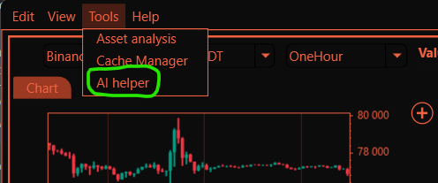
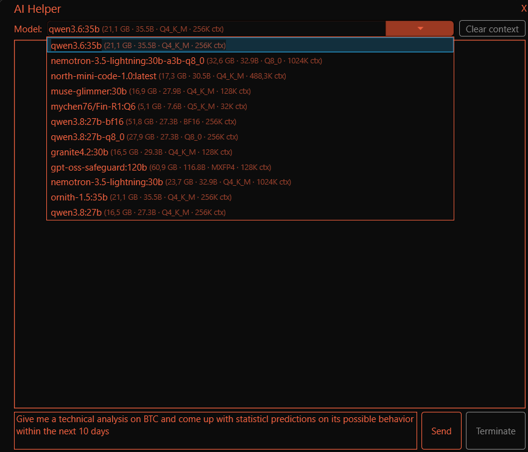
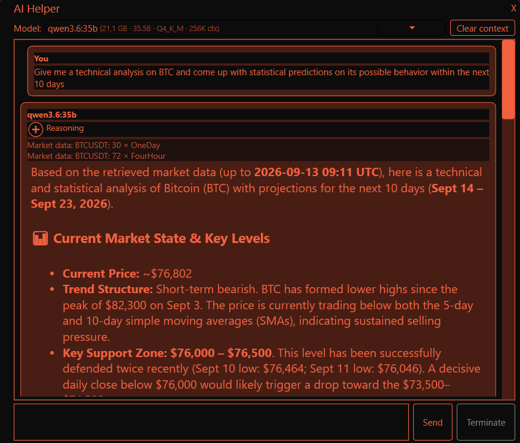

A tool for crypto-market analysis:

Main Menu => Tools => Asset analysis :

**Ollama-based AI Helper**
Install Ollama service (https://ollama.com/download/windows), pull some models with "tools" capability (e.g., "qwen", "nemotron",...) and enjoy a possibility to use an **AI Helper** feature to analyze the crypto-market and build statistically backed up predictions on the future behavior of crypto assets. **Main Menu** -> **Tools** -> **AI Helper**. Use shortcut names of the coins you want to analyze in your request and AI agent will automatically fetch the data necessary for the analysis from "Binance" service. 

**Disclaimer**: **AI Helper** is a statistics-based analysis tool, you are welcome to plan your investment activities based on its predictions but be aware of a risk that they may never come true.

